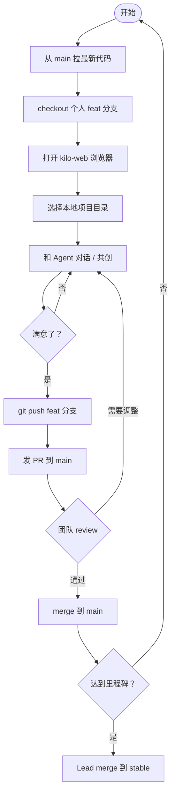

# Kilo Web — Kilocode 插件的浏览器版本

这是 [Kilo-Org/kilocode](https://github.com/Kilo-Org/kilocode) VSCode 插件的 Web 改造版本。
我们把插件 UI 完整地搬到了浏览器里运行，后端仍然是本地的 `opencode serve` 进程，Agent 直接操作你电脑上的真实代码库。

**目标**：让 PM、设计、研发在同一个浏览器页面里，和 Agent 共创 demo，不需要打开 VSCode。

---

## 和原版插件的功能对照

| 功能                          | 原版 VSCode 插件 | Kilo Web |
| ----------------------------- | :--------------: | :------: |
| 对话 / 多 Session 管理        | ✅               | ✅        |
| Agent 编辑文件、执行命令      | ✅               | ✅        |
| @ 提及文件                    | ✅               | ✅        |
| 优化提示词（enhance prompt）  | ✅               | ✅        |
| 中断生成（abort）             | ✅               | ✅        |
| 自动批准权限（auto-approve）  | ✅               | ✅        |
| Fork 会话                     | ✅               | ✅        |
| Marketplace 浏览 + 安装       | ✅               | ✅        |
| MCP 工具集成                  | ✅               | ✅        |
| 设置页（14 个 tab）           | ✅               | ✅        |
| 模式切换（Code / Architect…） | ✅               | ✅        |
| 内联补全 / ghost text         | ✅               | ❌        |
| 编辑器内 diff 高亮            | ✅               | ❌        |
| Git Worktree 管理             | ✅               | ❌        |
| VSCode 命令面板 / 快捷键      | ✅               | ❌        |
| 账号登录 / 云同步             | ✅               | ❌        |

简单说：保留了**所有对话和 Agent 能力**，去掉了**纯 IDE 专属功能**。

---

## 架构

```
浏览器 (localhost:5173)
  └── Kilo Web UI（原版 webview-ui，不改一行源码）
        │  postMessage 协议
        ▼
  web-vscode/provider.tsx（我们写的桥接层）
        │  HTTP + SSE
        ▼
  opencode serve (localhost:8787)
        │
        ▼
  本地文件系统 + AI 模型
```

我们通过 Vite 的 `resolveId` 把 webview 的 VSCode API import 重定向到桥接层，
**不动上游任何一行代码**，方便后续跟进上游更新。

---

## 一次性环境准备

### 1. Clone

```bash
git clone git@github.com:Bonnie978/kilocode.git
cd kilocode
```

### 2. 安装 bun

```bash
curl -fsSL https://bun.sh/install | bash
```

### 3. 装依赖

```bash
bun install
```

### 4. 配置模型 key

新建 `~/.config/kilo/kilo.json`（路径里是 `kilo`，不是 `opencode`）：

```json
{
  "$schema": "https://app.kilo.ai/config.json",
  "model": "newapi/glm-5.1",
  "small_model": "newapi/glm-5.1",
  "provider": {
    "newapi": {
      "name": "NewAPI",
      "npm": "@ai-sdk/openai-compatible",
      "options": {
        "baseURL": "https://infplacex.com/v1",
        "apiKey": "sk-你的key"
      },
      "models": {
        "glm-5.1": {
          "id": "glm-5.1",
          "name": "GLM 5.1",
          "tool_call": true,
          "limit": { "context": 128000, "output": 16384 }
        }
      }
    }
  },
  "permission": { "bash": "ask" }
}
```

> **注意**：`apiKey` 不要写进这个 README，向 Bonnie 私下获取。

---

## 启动

开两个终端：

```bash
# 终端 A：后端
bun run serve

# 终端 B：前端
bun run web
```

打开 <http://127.0.0.1:5173>，点左上角 📂 图标选择要操作的项目目录，即可开始。

---

## 团队共创分支约定

| 分支               | 用途                                  | push 权限              |
| ------------------ | ------------------------------------- | ---------------------- |
| `stable`           | 永远可用的基线，出问题时回滚到这里     | Lead 不定期手动 merge  |
| `main`             | 当前 demo 版，团队对外展示用           | PR 合入                |
| `feat/<你>-<想法>` | 你的个人实验分支，自由 vibe            | 自己随意 push          |

### 日常工作流



### 紧急回退

```bash
# 把某个文件恢复到 stable 版本
git checkout stable -- path/to/file
```

---

## 延伸阅读

- [docs/kilo-web/COLLABORATION.md](docs/kilo-web/COLLABORATION.md) — vibe-coding 工作流 + 角色分工
- [docs/kilo-web/runbook.md](docs/kilo-web/runbook.md) — 排错手册
- [docs/kilo-web/sdk-cheatsheet.md](docs/kilo-web/sdk-cheatsheet.md) — opencode SDK 速查
- [docs/kilo-web/README.md](docs/kilo-web/README.md) — 技术架构详解

---

基于 [Kilo-Org/kilocode](https://github.com/Kilo-Org/kilocode)，MIT 协议。
